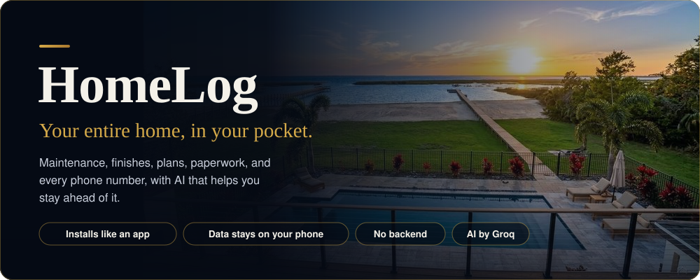
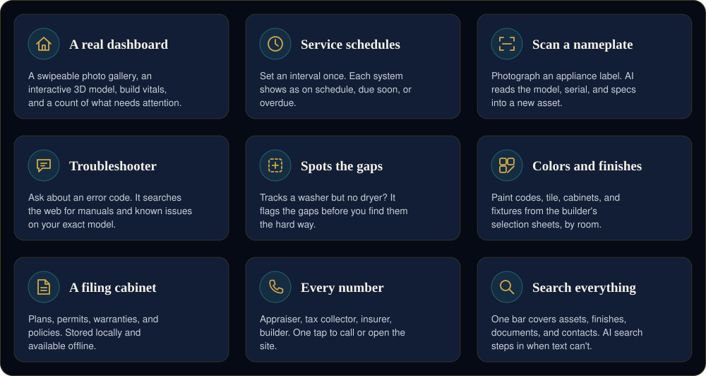
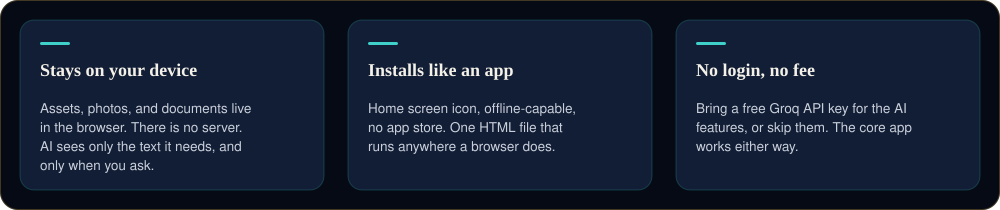

 

&nbsp;

 

Every home comes with a paper trail: the builder's paint codes, the water heater's serial number, warranty PDFs buried in an inbox, the tax collector's phone number you can never remember.

HomeLog puts all of it in one place, on your phone, and adds an AI layer that fills in the gaps when your memory doesn't. No login. No cloud database. No subscription. It's a single web app that installs like a native one and remembers everything so you don't have to.

 

## What's inside

 

<b>More on each feature</b>

 

**A real dashboard, not a spreadsheet.** Open the app and you're looking at your house: a swipeable photo gallery, an embedded interactive 3D model, time-lapse construction videos, and the vitals that matter (square footage, lot size, build specs) pulled straight from the source documents. At a glance, you see how many things need attention right now.

**Maintenance that remembers.** Track every system, including HVAC, plumbing, electrical, appliances, and structural, organized by room or by type. Set a service interval once and HomeLog tracks what's on schedule, what's due soon, and what's overdue. Not sure how often something should be serviced? One tap sends the asset to AI and returns a recommendation.

**Point your camera at a nameplate.** Snap a photo of an appliance label and AI reads the model number, serial number, manufacture date, and specs, then fills in a new asset.

**A troubleshooter that searches the web.** Ask about an error code and HomeLog searches live for manuals, error meanings, and known issues for your exact model, then gives a straight answer.

**An inventory that flags what's missing.** HomeLog looks at what you've tracked and tells you what's probably absent: a dryer for that washer, a thermostat for that AC unit.

**Every paint color and finish.** Every paint color, tile pattern, cabinet finish, and fixture spec from the builder's selection sheets, organized by room and searchable. Touching up a wall in five years takes one search.

**A filing cabinet for the paperwork.** Blueprints, permits, warranties, insurance policies, and contracts. Upload once, store locally, and read offline.

**Every number you'll need.** Property appraiser, tax collector, insurance, mortgage, builder, and architect, with call and website links built in.

**Search across everything.** One bar covers assets, finishes, documents, and contacts. When plain text can't find it, AI search takes over.

 

## Why it's built this way

 

## Under the hood

| | |
|---|---|
| **Interface** | Single-file HTML, CSS, and JS with no build step and no framework |
| **Storage** | IndexedDB via Dexie.js, fully local and fully offline |
| **AI** | Groq for vision, reasoning, and live web search |
| **Installability** | Web app manifest and service worker |
| **Hosting** | Static, on GitHub Pages or any web host |

 

## Get started

1. Open the [live app](https://johnlaz.github.io/homelog/app/) in Chrome or Safari for full camera and install support.
2. Tap **Install** or **Add to Home Screen** when prompted.
3. Open **Settings** and add a free [Groq API key](https://console.groq.com/keys) to turn on the AI features.
4. Start logging, or let the built-in reference data show you around.

There's no account to create and nothing to configure.

 

Built for homeowners who'd rather ask their house a question than dig through a filing cabinet.

